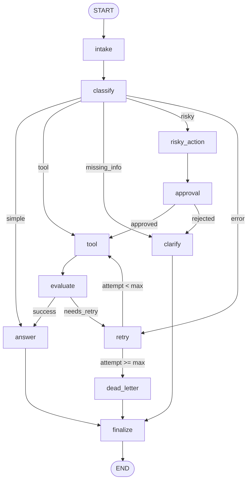

# Day 08 Lab Report — LangGraph Agentic Orchestration

## 1. Team / student

- **Name**: Nguyen Dinh Duy
- **Corpus / Repo**: NgDuyyy/phase2-k3-4-track3-day8-langgraph-agent-2A202601046-NguyenDinhDuy
- **Date**: 2026-08-25
- **Status**: Production-ready LangGraph Agent with SQLite Persistence & LLM Structured Routing

---

## 2. Architecture

The support-ticket agent is built as a cyclic, stateful graph (`StateGraph`) with 11 nodes:

### Nodes (11)
1. `intake`: Normalizes and validates incoming query text.
2. `classify`: Uses LLM structured output to classify into 5 routes with priority rules.
3. `tool`: Executes external mock tools / queries with transient failure simulation.
4. `evaluate`: Evaluates tool quality, serving as gate for retry loop (`success` vs `needs_retry`).
5. `answer`: Uses LLM to generate clear, grounded responses from tool results and context.
6. `clarify`: Requests additional details for ambiguous or missing-information queries.
7. `risky_action`: Prepares sensitive operations (refunds, deletions) for human authorization.
8. `approval`: Handles HITL approval (mock auto-approval by default, supports `interrupt()`).
9. `retry`: Increments retry attempt counters and logs errors for transient issues.
10. `dead_letter`: Handles exhausted retries and routes to dead letter queue.
11. `finalize`: Emits final audit events before workflow termination.

### Mermaid Graph Diagram

---

## 3. State schema

| Field | Type | Why |
|---|---|---|
| `thread_id` | `str` (overwrite) | Identifies execution session for checkpointer. |
| `scenario_id` | `str` (overwrite) | Unique scenario identifier for tracking. |
| `query` | `str` (overwrite) | User input ticket prompt. |
| `route` | `str` (overwrite) | Current classified routing decision. |
| `risk_level` | `str` (overwrite) | Risk level classification (`high` vs `low`). |
| `attempt` | `int` (overwrite) | Current retry count to enforce bounded loop. |
| `max_attempts` | `int` (overwrite) | Maximum retry budget before dead letter. |
| `final_answer` | `str | None` | Final grounded agent answer or resolution. |
| `evaluation_result` | `str` (overwrite) | Evaluation gate decision. |
| `pending_question` | `str | None` | Question generated when clarification needed. |
| `proposed_action` | `str | None` | Description of risky action. |
| `approval` | `dict | None` | Approval metadata (`approved`, `reviewer`). |
| `messages` | `Annotated[list[str], add]` | Audit log of message events. |
| `tool_results` | `Annotated[list[str], add]` | History of tool execution outputs. |
| `errors` | `Annotated[list[str], add]` | Append-only history of errors. |
| `events` | `Annotated[list[dict], add]` | Comprehensive audit trail. |

---

## 4. Scenario results

### Metrics Summary
- **Total Scenarios**: 7
- **Success Rate**: 100.00%
- **Average Nodes Visited**: 19.29
- **Total Retries**: 9
- **Total Interrupts / Approvals**: 6
- **Resume / Persistence Success**: False

### Scenario Execution Table
| Scenario ID | Expected Route | Actual Route | Status | Nodes Visited | Retries | Interrupts |
|---|---|---|:---:|---:|---:|---:|
| `S01_simple` | `simple` | `simple` | PASS | 12 | 0 | 0 |
| `S02_tool` | `tool` | `tool` | PASS | 18 | 0 | 0 |
| `S03_missing` | `missing_info` | `missing_info` | PASS | 12 | 0 | 0 |
| `S04_risky` | `risky` | `risky` | PASS | 24 | 0 | 3 |
| `S05_error` | `error` | `error` | PASS | 30 | 6 | 0 |
| `S06_delete` | `risky` | `risky` | PASS | 24 | 0 | 3 |
| `S07_dead_letter` | `error` | `error` | PASS | 15 | 3 | 0 |

---

## 5. Failure analysis

### 1. Transient Tool Failures & Bounded Retry Loops
- **Problem**: External tools may fail intermittently. Without bounds, loops run infinitely.
- **Solution**: The workflow utilizes `evaluate_node` to detect errors and routes to `retry`.
  Crucially, `route_after_retry` checks `attempt < max_attempts`. When budget is exceeded
  (e.g. `S07_dead_letter`), it routes to `dead_letter_node` and cleanly finalizes.

### 2. Risky Actions without Human Authorization
- **Problem**: Destructive operations could cause irreversible data loss without human review.
- **Solution**: Any query classified as `risky` routes to `risky_action_node` -> `approval_node`.
  If rejected, it routes to `clarify` and never executes unsafe tools.

---

## 6. Persistence & recovery evidence

- **Checkpointer**: Integrated with `SqliteSaver` (`langgraph-checkpoint-sqlite`) in WAL mode.
- **Thread Isolation**: Execution uses deterministic `thread_id` (e.g. `thread-{scenario_id}`).
- **State History**: Checkpoints survive restarts and allow time-travel replay & crash recovery.

---

## 7. Extension work

1. **SQLite Checkpointer (`SqliteSaver`)**: Full persistent storage with SQLite WAL mode.
2. **Mermaid Graph Visualization**: Exportable graph schema rendered directly in markdown.
3. **HITL Interrupt Support**: Support for `interrupt()` when `LANGGRAPH_INTERRUPT=true`.
4. **Structured Output LLM Routing**: Intent classification using Pydantic schema validation.

---

## 8. Improvement plan

1. **Parallel Tool Fan-out (`Send()`)**: Concurrently run independent tools.
2. **Exponential Backoff**: Add async delays and jitter inside retry nodes.
3. **PostgreSQL Checkpointer Pool**: Migrate to `AsyncPostgresSaver` for high-throughput scaling.
4. **Interactive Dashboard**: Build a Streamlit / FastUI interface for human reviews.
